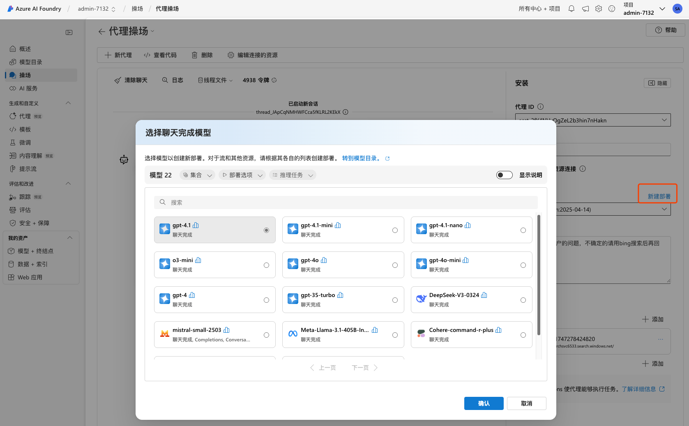

# Agent RAG with Azure AI Search
这个Lab的目的是让Azure AI Foundry的Agent可以使用Azure AI Search来进行检索实现Agent RAG. 


以下是主要步骤：

## 准备服务。可以运行脚本run.sh， 准备好AI Search和Storage Account
- 创建资源组
- 创建 Azure 搜索服务（Basic SKU）并启用系统分配的托管身份
- 创建存储账号（Standard_LRS）
- 在存储账号下创建名为 “doc” 的 Blob 容器
- **批量上传本地 doc 目录下的文件到该容器**
- 将搜索服务的托管身份赋予存储账号 “Storage Blob Data Contributor” 角色

也可以手动创建资源， 可以参考: 
- https://learn.microsoft.com/zh-cn/azure/search/search-get-started-portal-import-vectors?tabs=sample-data-storage%2Cmodel-aoai%2Cconnect-data-storage

- https://learn.microsoft.com/zh-cn/azure/ai-services/agents/how-to/tools/azure-ai-search?tabs=azureaifoundry%2Cpython&pivots=overview-azure-ai-search


## 部署AOAI 的模型 和 Embedding 服务
- 支持Agent的模型


- 部署Embedding服务 <br/>
支持 text-embedding-ada-002、text-embedding-3-large、text-embedding-3-small

- 如果还没有Azure OpenAI的服务，也可以在下一步构建索引时创建
 <br/>

- [设置嵌入模型](https://learn.microsoft.com/zh-cn/azure/search/search-get-started-portal-import-vectors?tabs=sample-data-storage%2Cmodel-aoai%2Cconnect-data-storage#set-up-embedding-models)


## 构建索引
[创建索引](https://learn.microsoft.com/zh-cn/azure/search/search-get-started-portal-import-vectors?tabs=sample-data-storage%2Cmodel-aoai%2Cconnect-data-storage#start-the-wizard) <br/>

## 将AI Search连接到AI Foundry Project
- 添加项目的连接到AI Search
 <br/>
- 在Agent中，添加AI Search工具
 <br/>
 <br/>

## 在PlayGroud中测试Agent


# Optional 
## Azure SDK for agent 

```bash
pip install azure-ai-projects
cp .env.sample .env
```
- 在.env中设置Azure的环境变量

## 运行示例
```bash
python sample_agents_azure_ai_search.py
```
 <br/>
https://github.com/Azure/azure-sdk-for-python/blob/main/sdk/ai/azure-ai-projects/samples/agents/sample_agents_azure_ai_search.py
